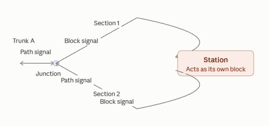
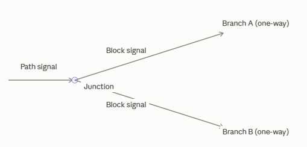
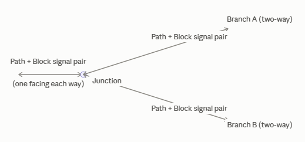
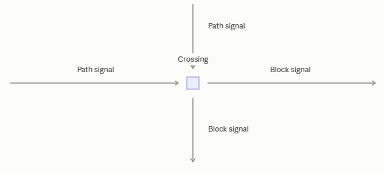
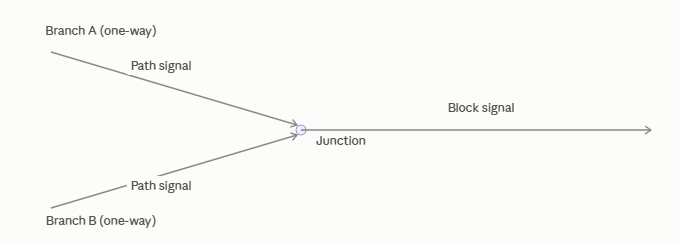
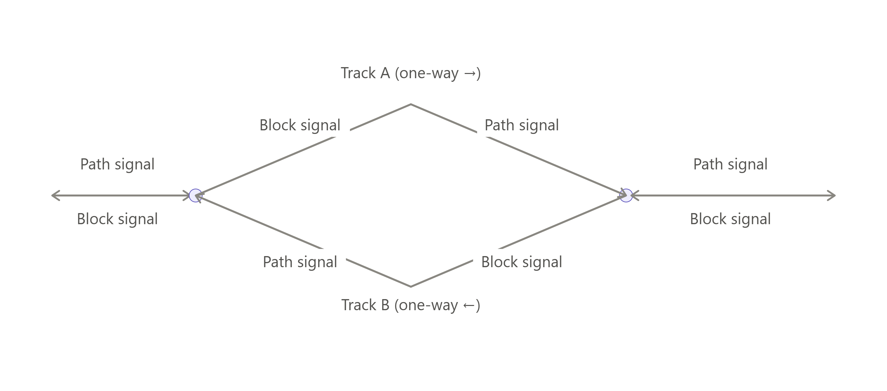
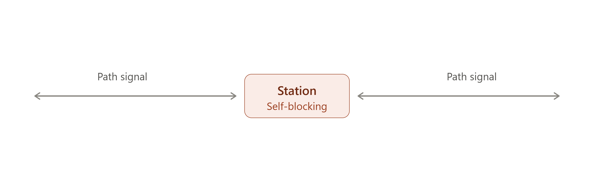
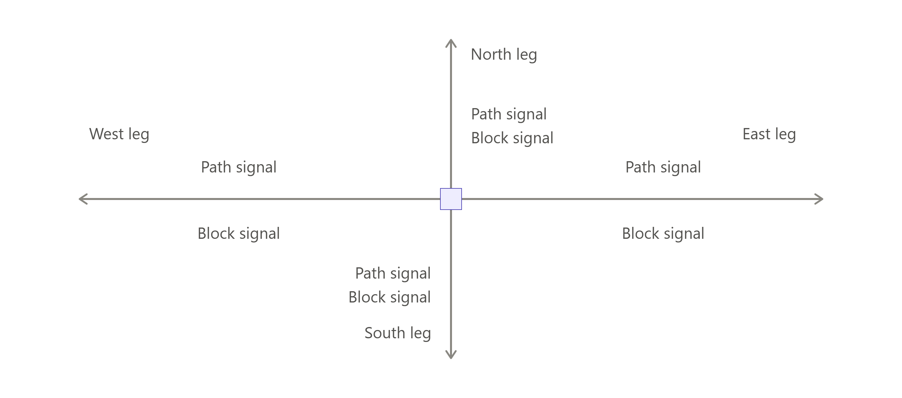
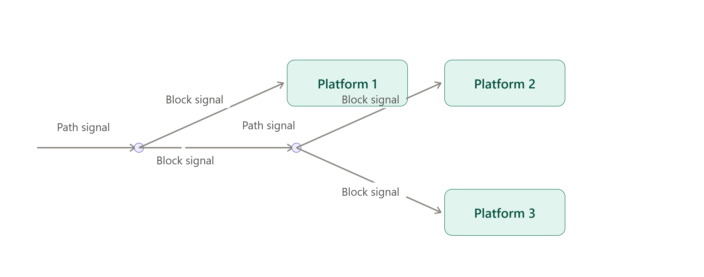

# Routing And Signalling: Junction Configurations

## Loop Into/Out of Train Station

This is a classic "station loop off a two-way trunk" layout, and it's worth drawing out since the signal logic depends entirely on where the branches and merges are.The key thing driving this layout is that both junctions (the split and the merge) are places where a train has a routing decision or a potential conflict with oncoming traffic — that's exactly where Path Signals belong. The straight stretches in between are just single-train-at-a-time reservations — Block Signals handle those fine.

A few practical notes that don't fit neatly in the diagram:

- **At the split**, since the main line is two-way, trains can approach that junction from either direction. Put a Path Signal facing each direction on the trunk side, so a train only commits to entering the junction if its chosen route (straight through, or into the loop) is actually clear all the way through. A plain Block Signal here would let a train stop *inside* the junction waiting on a block, fouling the crossing for everyone else.
- **On the loop itself** (entry leg, station, exit leg), it's one-way and there's no branching, so ordinary Block Signals are enough — space them so a block is roughly train-length, and add extras if you want more than one train queuing for the station at a time.
- **At the merge**, the exit leg is one entry into that junction and the trunk (from the far side) is potentially another — both need Path Signals, and the through-track exits get Block Signals just past the junction. This stops a train from committing to a merge that would put it nose-to-nose with a train still occupying the trunk.
- Avoid putting two Path Signals back to back anywhere (e.g., right before and right after a junction) — that tends to cause unnecessary reservation conflicts. One Path Signal per junction, on the entry side, is the pattern to stick to.

If your loop line is long, it's also fine to drop an extra Block Signal or two partway along the entry/exit legs — that just lets more trains queue for the station without them backing up onto the main line.

### Connections

- Trunk A → junction: one Path Signal, facing into the junction (single direction, no mirroring needed).
- Junction → Section 1 (entrance): Block Signal
- Station: self-blocking
- Station → Section 2 (exit): Block Signal
- Section 2 → junction: one Path Signal, facing into the junction, protecting the merge back onto Trunk A.

## One-way section splitting into two one-way sections

Only one direction of travel exists anywhere here, so it's the simplest case: a Path Signal on the incoming section (it's choosing between two routes, so it must reserve the whole path before committing), and a plain Block Signal at the start of each of the two branches.

## Two-way section splitting into two two-way sections

This one's genuinely more involved than the previous two junctions we've worked through, because every leg is a real through-route — a train could be arriving from any of the three legs, bound for either of the other two. That's the "middle of a through-route" case I flagged earlier as needing mirrored signals, and here it applies to all three sides at once:

- On each of the three legs, place a Path Signal facing into the junction (protects the routing decision for trains entering from that leg) and a Block Signal facing away from the junction (governs trains that just exited via that leg, heading further down it).
- That's 6 signals total — a facing pair on each leg, right next to the junction.

This is the most complex of the three shapes, since it's the only one where you truly need signals in both directions on every approach.

## Cross-shaped intersection with two one-way sections

This is different in kind from the other two: it's not a switch at all — the tracks physically cross without connecting, so there's no route choice, just a shared danger zone. Path Signal on each incoming line (before the crossing), Block Signal on each outgoing line (after it). Since both lines are one-way, only one signal is needed per line — no mirroring.

## Other common shapes with genuinely different rules

Beyond these three and the ones we've already covered (single dead-end junction, station loop), here's roughly what else comes up in practice, with the distinguishing factor each time:

1. One-way merge (two one-way sections merging into one).

 The mirror of #1: Path Signal on both incoming branches, Block Signal on the single outgoing section. Different from #1 because both approaches need to reserve, not just one.

2. Passing loop (a two-way single track that briefly splits into two parallel one-way tracks, then rejoins)

 Used to let two trains going opposite directions pass each other. Structurally it's #1 and its mirror stitched together: Path Signal where the single track splits, Block Signals along each of the two parallel one-way tracks, Path Signal where they rejoin. Different from a normal fork because both branches lead to the same place, used simultaneously by opposite-direction traffic.

 This is a genuine "through-route" junction at both ends, unlike the dead-end trunk case — trains actually travel both directions through each junction point over time (that's the whole reason the loop exists). So each end needs the full pair: a Path Signal facing into the junction (for trains about to enter one of the two parallel tracks) and a Block Signal facing away (for trains that just merged back onto the two-way section). Each parallel track itself just needs a Block Signal at its start and a Path Signal at its far end where it rejoins.

3. In-line two-way station (no loop, single track runs straight through)

 Unlike the dead-end station junction from earlier, both sides of the station are genuine through-routes. Needs Path Signals facing the station from both directions, since either direction could arrive and must reserve the platform block before entering. This is the "through-route" case, not the "terminating spur" case.

 The simplest of the five, but it's the one most people get wrong by using Block Signals here out of habit. Since trains can genuinely arrive from either direction, both approaches need a Path Signal facing the station, not a Block Signal — a Block Signal would let a train stop partway into the platform area if it's occupied from the other side, whereas the Path Signal makes it wait clear of the station entirely until the platform is free.

4. Four-way switched intersection (tracks actually connect, so trains can turn, unlike the plain crossing in #3)

 Same idea as #2 but with four legs instead of three: Path Signal on every incoming approach, Block Signal on every outgoing exit. More reservation complexity since a train could route to any of three other legs.

 This is the two-way wye logic extended to four legs instead of three — every leg gets a facing Path/Block pair, since a train from any leg could be bound for any of the other three. Eight signals total, and it's the most reservation-heavy layout of the bunch, since a train entering from one leg needs its whole route clear across the intersection to whichever leg it's headed toward.

5. Multi-platform station throat (chained switches)

 Chains of #1 and its mirror. The main risk here is stacking two Path Signals back-to-back across successive switches, which can cause reservation deadlock — so Block Signals need to separate each switch along the chain.

The rule this one demonstrates: never let a Path Signal feed directly into another Path Signal. The path from the first junction toward the second gets a Block Signal right after leaving the first switch, and only picks up a Path Signal again once it's actually approaching the second switch. Skipping that buffer is what causes the deadlock-prone chaining the earlier community guidance warned about — a train reserving all the way through the first switch would also try to reserve through the second, and if that reservation fails, it can end up stuck straddling both.

**The above covers the large majority of common layouts.**
